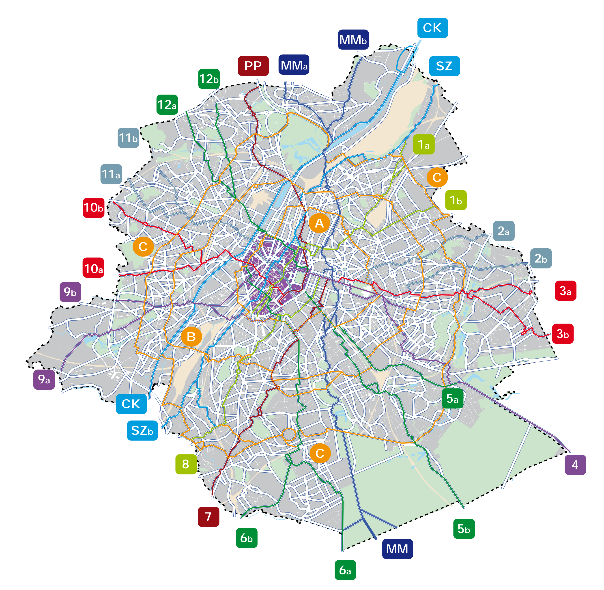
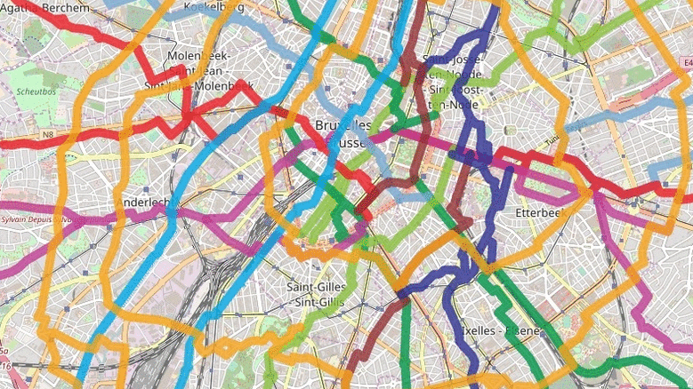

# The OSM Brussels Cycling Route Validation Tool

## Introducing the Brussels bike data team

During the month of July 2017 three students, guided by expert coaches, worked on an OpenStreetMap (OSM) focused project. Our work was done in the context of the 2017 open Summer of code, which is an initiative of Open Knowledge Belgium. The oSoc challenges teams of students to solve real-world problems through application development. At the 7th edition of oSoc, a total of 40 students worked on 10 cutting-edge projects build on open source code.

## The Brussels regional bike network

Brussels have has developed region wide cycling network. Known as the ICR (Itinéraires Cyclables Régionaux) in French or the GFR (Gewestelijke Fietsroutes) in Dutch, the network aims for fluid and safe journeys spanning all 19 communes of the region.To encourage more cyclists on more efficient and safer routes, one approach is to ensure that traveller information is robust enough to guide cyclists to these routes. 

## A dedicated cycling app for the Brussels cycling network

Nowadays most people use their phone to route themselves while their driving or using public transport. These apps usually incorporate the signage that travellers will see in their surrounding environment. The #oSoc Bike for Brussels team are pursuing this same strategy. This means that cyclists can better situate themselves in relation to signage.

The development of the app demonstrates the power of high quality open data and would inspire the creation of other advanced apps for the public to support them through everyday activities. This work highlights the importance of supporting open map data creators to support open source applications. 

## OSM as the source of map data for the app

For the app to work having an open map data source geodata of the routes is first necessary. This is where our work becomes relevant, since the map data from OSM needs to be complete and accurate in relation to the physical network’s signage.

## Using Brussels’ map data as a reference

The regional cycling infrastructure is represented by is open and online map data. Individual routes has information about their corresponding route colour and name. This is a useful reference, however if the OSM community wanted to compare the completeness and correctness of OSM, a manual comparison will be too tedious. 

## Our solution: a webtool for Brussels bike data completeness and correctness on OSM 

The result of our work is a web tool that supports the Belgian OSM community by assisting them to identify missing map data on the regional cycling network of Brussels. The tool, avaliable from this via [cyclenetworks.osm.be](http://cyclenetworks.osm.be/),

The webtool continuously refreshes itself and automatically identifies potential issues on OSM. Map editors can then use the website to guide their editing. The technical underpinning of the verification allows two main approaches on analysis of data per individual route:

- Identifying geometric conflicts of issues of general overlap when the OSM data does not match the Brussels data, and vice-versa;
- Identifying possible misplaced attribute data known as tags in the OSM data, including route code and colour, network name, and the operator of the route.

The image below provides an example of all the cycling routes and routes that are apparently missing in OSM. Apart from this visual aid, the website provides more technical information, such as tagging issues, and also an option to download geojsons of routes.  

## A comparsion of cycling routes and then gaps in OSM compared to the reference data

## Using the OSM-Brussels data comparison tool

Our web tool is intended for advanced OSM editors who are highly verse with editing route relations with JOSM. Therefore any work should be done through collaboration through experts within community should be done. You can make contact with community via: community@osm.be

In summary, the tool that we are developing aims to assist and encourage the verification of the OSM cycling routes in Brussels. Because we are an open source project, the code can be reused for other situations all over the world when one geodataset needs to be used as a reference, to compare OSM geodata for completeness and correctness. The open source approach also extend to our collaborating team mates who are working on an mobile web app that uses the route coding and colouring scheme in their routing interface. 

## Some useful links

* The OSM validation web tool via [cyclenetworks.osm.be](http://cyclenetworks.osm.be/)
* [open Summer of code](http://2017.summerofcode.be/) (an initiative of [Open Knowledge Belgium](https://www.openknowledge.be/))
* Event that was organised within this theme: [Open Bike Data & Mapping with OpenStreetMap](https://www.eventbrite.com/e/open-bike-data-mapping-with-openstreetmap-registration-34806438996)
* The [Brussels government's mobility department](http://mobility.brussels/)
* Info about the [ICR (Itinéraires Cyclables Régionaux)](http://www.bruxellesmobilite.irisnet.be/articles/velo/itineraires-cyclables) in French
* Info about the [GFR (Gewestelijke Fietsroutes)](http://www.mobielbrussel.irisnet.be/articles/fiets/fietsroutes) in Dutch
* The [Bike for Brussels](http://bike.brussels/) social media awareness campaign
* Freely online map [data from the Brussels government](http://data-mobility.brussels/mobigis/nl/)
* [Info on the Java OpenStreetMap Editor (JOSM)](https://josm.openstreetmap.de/)
* OSM wiki on [comparison and quality control](http://wiki.openstreetmap.org/wiki/Comparing_OSM_with_other_datasets)
* OSM wiki on map [conflation](http://wiki.openstreetmap.org/wiki/Conflation)
* [Mapping conventions, including for cycling routes](http://wiki.openstreetmap.org/wiki/WikiProject_Belgium/Conventions/Cycle_Routes) for Belgium
* OSM wiki on the [Brussels Capital Region](http://wiki.openstreetmap.org/wiki/WikiProject_Belgium/Cycle_Routes%23Itin.C3.A9raires_Cyclables_R.C3.A9gionaux_-_Gewestelijke_Fietsroute)
* [The testing version of the Brussels cycling routing webapp](https://osoc17.github.io/rideaway-frontend/)
